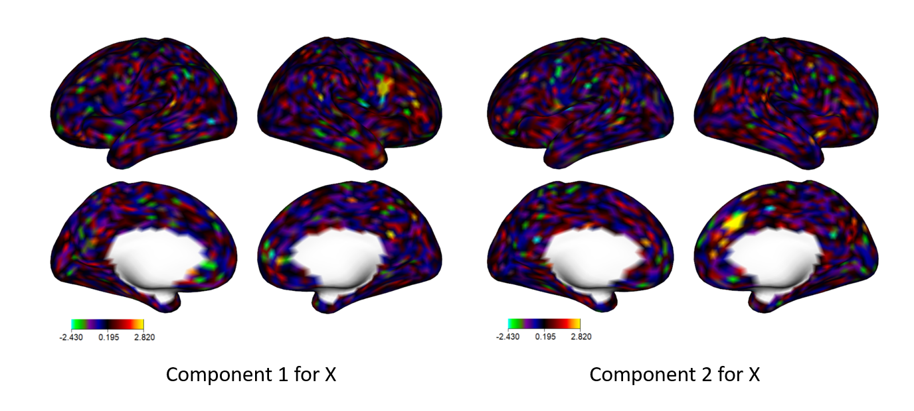
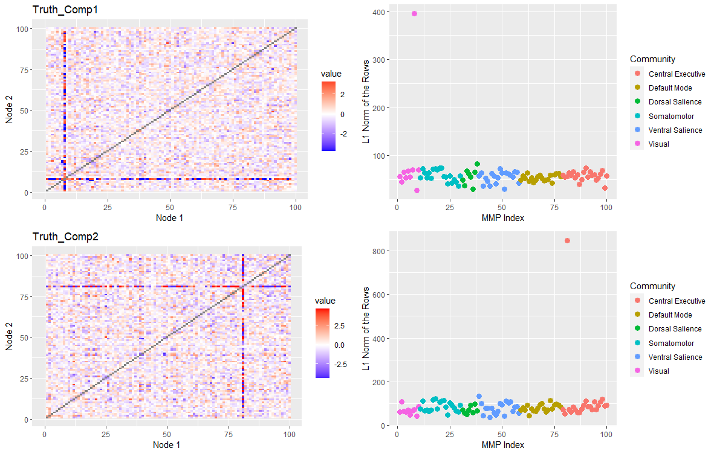
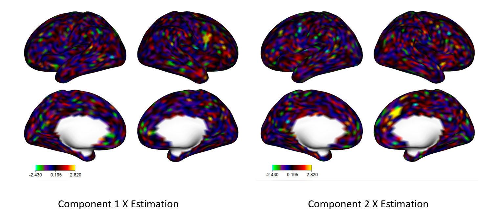
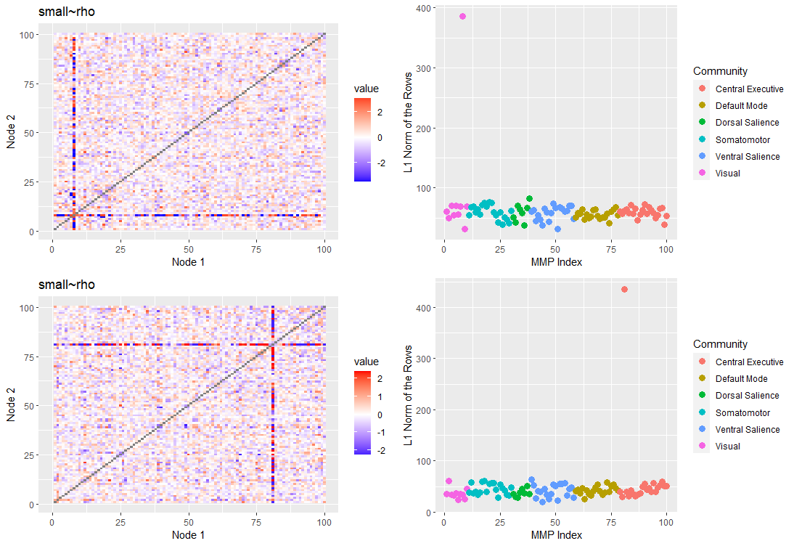

# singR 

singR package is built on SING method <https://github.com/thebrisklab/SING>.
SING is used to extract joint and individual non-gaussian components from different datasets. This is a tutorial example supporting the paper **Simultaneous Non-Gaussian Component Analysis (SING) for Data Integration in Neuroimaging Benjamin Risk, Irina Gaynanova** https://arxiv.org/abs/2005.00597v1

## Installation

You can install singR from github with:
```{r,eval=FALSE}
library(devtools)
install_github("thebrisklab/singR")

```


## Quick start guide
#### Load package and data
##### for the quick start, we use a compressed version to accelerate the computation, which is a subpart of correlation matrix and 2k-resolution dtseries data. 

```{r eval=FALSE}
# Load the package
library(singR)

# Read and visualize data
load(file = "Small_Simulated_data.Rdata")
# It contains dX, dY, mj, new_sIx,new_sIy,new_sjx,new_sjy

## True Data and signchange
Sxtrue = t(new_sjx) #dim(Sxtrue) px x n
Sytrue = t(new_sjy)

Sxtrue = signchange(Sxtrue) #sign degree amplification
Sytrue = signchange(Sytrue)


```
#### Plot for true X component
##### This step needs ciftiTools package and workbench, which can be found in <https://github.com/mandymejia/ciftiTools>
```{r eval=FALSE}
library(ciftiTools)
ciftiTools.setOption("wb_path", "C:/Software/workbench")

xii_template <- read_cifti("c:/Software/Data/tfMRI_MOTOR_LR_Atlas.dtseries.nii", brainstructures=c("left", "right"),resamp_res = 2000) 
# resample the template to 2k resolution
xii_new <- newdata_xifti(xii_template, Sxtrue)


view_xifti_surface(select_xifti(xii_new,1),zlim = c(-2.43,2.82)) # component1 true
view_xifti_surface(select_xifti(xii_new,2),zlim = c(-2.43,2.82)) # component2 true

```

```{r echo=FALSE}


```


#### Plot for true Y component
```{r eval=FALSE}
library(cowplot)
# plot for the true component of Y
out_true1 = plotNetwork_change(Sytrue[,1], title='Truth',qmin=0.005, qmax=0.995, path = 'new_mmp.csv') 
out_true2 = plotNetwork_change(Sytrue[,2], title='Truth',qmin=0.005, qmax=0.995, path = 'new_mmp.csv') 

# function plotNetwork_change is tailored for this compressed version data.
# The original function is called plotNetwork, which is set for the standard version of correlation matrix.
p1=out_true1$netmatfig
p2=out_true1$loadingsfig
p3=out_true2$netmatfig
p4=out_true2$loadingsfig

plot_grid(p1,p2,p3,p4,nrow = 2)
```


```{r echo=FALSE}


```

### Pipeline of SING method
```{r eval=FALSE}
# Center X and Y
n = nrow(dX)
pX = ncol(dX)
pY = ncol(dY)
dXcentered <- dX - matrix(rowMeans(dX), n, pX, byrow = F)
dYcentered <- dY - matrix(rowMeans(dY), n, pY, byrow = F)

```


#### Apply separate JB
```{r eval=FALSE}
# JB on X
estX_JB = lngca(xData = t(dX), n.comp = 12, whiten = 'sqrtprec', restarts.pbyd = 20, distribution='JB') #Note: make n.comp=nsubjects-1 on real data when computationally feasible. For this tutorial, to save time, we have reduced to n.comp=12, which is a number greater than the true number of components.
Mx_JB = est.M.ols(sData = estX_JB$S, xData = t(dX)) 
# NOTE: for centered X, equivalent to xData %*% sData/(px-1)
Uxfull <- estX_JB$Ws  
# Ax = Ux %*% Lx, where Lx is the whitened matrix from covariance matrix of dX.


# JB on Y
estY_JB = lngca(xData = t(dY), n.comp = 12, whiten = 'sqrtprec', restarts.pbyd = 20, distribution='JB')
My_JB = est.M.ols(sData = estY_JB$S, xData = t(dY))
Uyfull <- estY_JB$Ws 
```


#### Get joint components
```{r eval=FALSE}
# Greedy Match
matchMxMy = greedymatch(t(Mx_JB), t(My_JB), Ux = t(Uxfull), Uy = t(Uyfull))

# Use permutation test to get the p-value of each match.
permJoint <- permTestJointRank(matchMxMy$Mx,matchMxMy$My,alpha = 0.05,nperm = 1000)
pval_joint = permJoint$pvalues
joint_rank = permJoint$rj
joint_rank  # the true value in this example is 2.

```

#### Whiten dX and dY
```{r eval=FALSE}
# For X
# Scale rowwise
est.sigmaXA = tcrossprod(dXcentered)/(pX-1)  ## dXcentered %*% t(dXcentered), which is the covariance matrix with n x n.
whitenerXA = est.sigmaXA%^%(-0.5)   # ZCA Whitening, Lx. 
xDataA = whitenerXA %*% dXcentered   # Xw = Lx %*% Xc.matrix with n x px. 
invLx = est.sigmaXA%^%(0.5) # Inverse matrix of Lx, which is the whitenerXA aforemetioned. 

# For Y
# Scale rowwise
est.sigmaYA = tcrossprod(dYcentered)/(pY-1)  ## since already centered, can just take tcrossprod
whitenerYA = est.sigmaYA%^%(-0.5)   # ZCA Whitening
yDataA = whitenerYA %*% dYcentered   
invLy = est.sigmaYA%^%(0.5)
```

#### Curvilinear search
```{r eval=FALSE}
# Calculate JB values
JBall = calculateJB(matchMxMy$Ux[1:joint_rank, ], X = xDataA) + calculateJB(matchMxMy$Uy[1:joint_rank, ], X = yDataA) 
# the columns of Ux & Uy are up to the joint_rank

# JB and tolerance parameters
alpha = 0.8
tol = 1e-10

## Small rho
rho = JBall/10
# medium rho, rho = JBall
# large rho, rho = JBall * 10

out_indiv_small <- curvilinear_c(invLx = invLx, invLy = invLy, xData = xDataA, yData = yDataA, Ux = matchMxMy$Ux, Uy = matchMxMy$Uy, rho = rho, tol = tol, alpha = alpha, maxiter = 1500, r0 = 2)
# curvilinear search with C code
```

### Estimation and Plot

#### Outcome
```{r eval=FALSE}
#### Estimation by Small rho
Sx_rhoSmall = t(out_indiv_small$Ux[1:2, ] %*% xDataA)
Sy_rhoSmall = t(out_indiv_small$Uy[1:2, ] %*% yDataA)

#### Signchange for estimation
Sx_rhoSmall = signchange(Sx_rhoSmall)
Sy_rhoSmall = signchange(Sy_rhoSmall)

```

#### Estimation plot for X

```{r eval=FALSE}
xii_new <- newdata_xifti(xii_template, cbind(Sxtrue,Sx_rhoSmall))

view_xifti_surface(select_xifti(xii_new,3),zlim = c(-2.43,2.82)) # component1 small rho
view_xifti_surface(select_xifti(xii_new,4),zlim = c(-2.43,2.82)) # component2 small rho

```

```{r echo=FALSE}

```


#### Estimation plot for Y
```{r eval=FALSE}
library(cowplot)

out_rhoSmall1 = plotNetwork_change(Sy_rhoSmall[,1], title='small~rho',qmin=0.005, qmax=0.995, path = 'new_mmp.csv') 
out_rhoSmall2 = plotNetwork_change(Sy_rhoSmall[,2], title='small~rho',qmin=0.005, qmax=0.995, path = 'new_mmp.csv')

p5=out_rhoSmall1$netmatfig
p6=out_rhoSmall1$loadingsfig
p7=out_rhoSmall2$netmatfig
p8=out_rhoSmall2$loadingsfig

plot_grid(p5,p6,p7,p8,nrow = 2)
```

```{r echo=FALSE}

```


