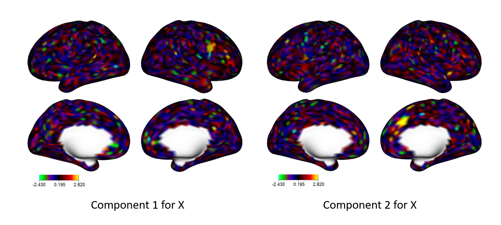
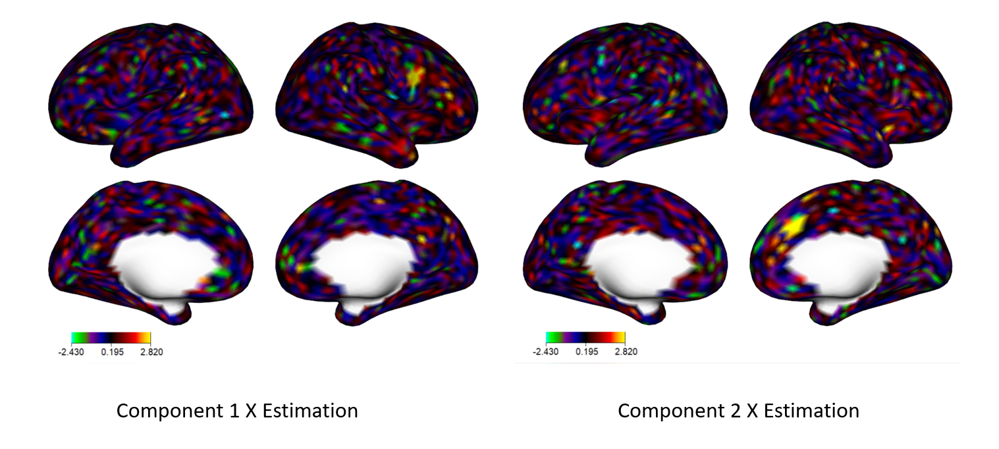
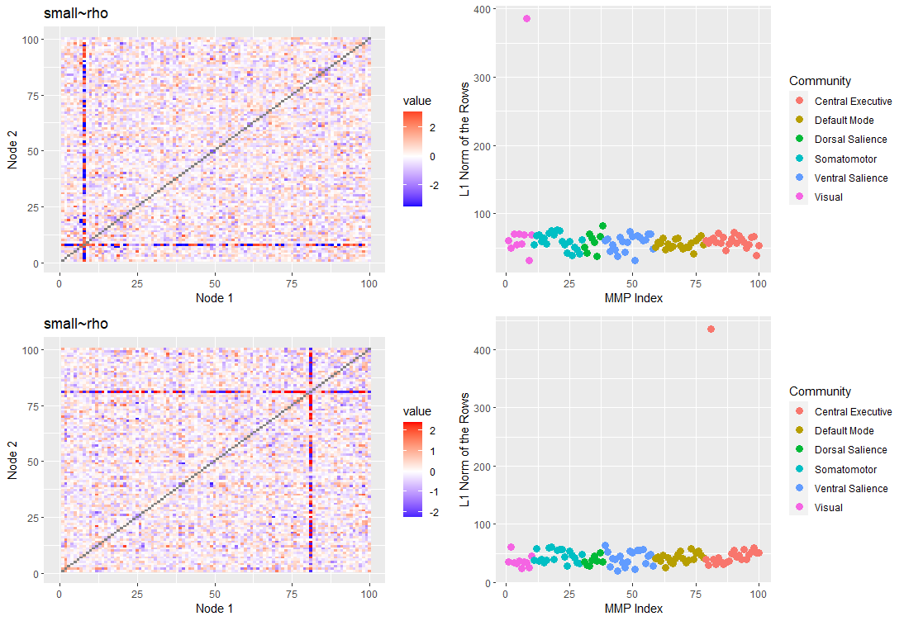

<!-- badges: start -->

[](https://github.com/thebrisklab/singR/actions)
[](https://app.codecov.io/gh/thebrisklab/singR?branch=main)
<!-- badges: end -->

# singR

singR package is built on SING method
<https://github.com/thebrisklab/SING>. SING is used to extract joint and
individual non-gaussian components from different datasets. This is a
tutorial example supporting the paper **Simultaneous Non-Gaussian
Component Analysis (SING) for Data Integration in Neuroimaging Benjamin
Risk, Irina Gaynanova** <https://arxiv.org/abs/2005.00597v1>

## Installation

You can install singR from github with:

``` r
library(devtools)
install_github("thebrisklab/singR")
```

## Quick start guide

#### Load package and data

##### for the quick start, we use a compressed version to accelerate the computation, which is a subpart of correlation matrix and 2k-resolution dtseries data.

``` r
# Load the package
library(singR)

# Read and visualize data
load("extdata/simdata.rda") # built-in dataset for real data simulation

# It contains dX, dY, mj, sIx,sIy,sjx,sjy

## True Data and signchange
Sxtrue = t(simdata$sjx) #dim(Sxtrue) px x n
Sytrue = t(simdata$sjy)

Sxtrue = signchange(Sxtrue) #sign degree amplification
Sytrue = signchange(Sytrue)
```

#### Plot for true X component

##### This step needs ciftiTools package and workbench, which can be found in <https://github.com/mandymejia/ciftiTools>

``` r
library(ciftiTools)
ciftiTools.setOption("wb_path", "C:/Software/workbench")

xii_template <- read_cifti("extdata/template.dtseries.nii", brainstructures=c("left", "right"),resamp_res = 2000) #the template cifti file is built in the package
# resample the template to 2k resolution
xii_new <- newdata_xifti(xii_template, Sxtrue)


view_xifti_surface(select_xifti(xii_new,1),zlim = c(-2.43,2.82)) # component1 true
view_xifti_surface(select_xifti(xii_new,2),zlim = c(-2.43,2.82)) # component2 true
```



``` r
#define plotNetwork_change
plotNetwork_change = function(component,title='',qmin=0.005, qmax=0.995, path = '~/Dropbox/JINGCA/Data/community_affiliation_mmpplus.csv',make.diag=NA) {
  # component:
  # vectorized network of length choose(n,2)
  require(ggplot2)
  require(grid)
  require(scales)

  # load communities for plotting:
  mmp_modules = read.csv(path)
  mmp_order = order(mmp_modules$Community_Vector)

  #check community labels:
  #table(mmp_modules$Community_Label)
  #table(mmp_modules$Community_Label,mmp_modules$Community_Vector)

  #labels = c('VI','SM','DS','VS','DM','CE','SC')
  #coords = c(0,70.5,124.5,148.5,197.5,293.5,360.5)


  zmin = quantile(component,qmin)
  zmax = quantile(component,qmax)

  netmat = vec2net(component,make.diag)

  meltsub = create.graph.long(netmat,mmp_order)
  #g2 = ggplot(meltsub, aes(X1,X2,fill=value))+ geom_tile()+ scale_fill_gradient2(low = "blue",  high = "red",limits=c(zmin,zmax),oob=squish)+labs(title = paste0("Component ",component), x = "Node 1", y = "Node 2")+coord_cartesian(clip='off',xlim=c(-0,390))

  g2 = ggplot(meltsub, aes(X1,X2,fill=value))+
    geom_tile()+
    scale_fill_gradient2(low = "blue",  high = "red",limits=c(zmin,zmax),oob=squish)+
    labs(title = title, x = "Node 1", y = "Node 2")+
    coord_cartesian(clip='off',xlim=c(-0,100))

  #for (i in 1:7) {
  #  if (i!=3) {
  #    g2 = g2+geom_hline(yintercept = coords[i],linetype="dotted",size=0.5)+geom_vline(xintercept = coords[i],linetype="dotted",size=0.5)+annotation_custom(grob = textGrob(label = labels[i], hjust = 0, gp = gpar(cex = 1)),ymin = (coords[i]+10), ymax = (coords[i]+10), xmin = 385, xmax = 385)+annotation_custom(grob = textGrob(label = labels[i], hjust = 0, gp = gpar(cex = 1)),xmin = (coords[i]+10), xmax = (coords[i]+10), ymin = -7, ymax = -7)
  #  } else{
  #    g2 = g2+geom_hline(yintercept = coords[i],linetype="dotted",size=0.5)+geom_vline(xintercept = coords[i],linetype="dotted",size=0.5)+annotation_custom(grob = textGrob(label = labels[i], hjust = 0, gp = gpar(cex = 1)),ymin = (coords[i]+10), ymax = (coords[i]+10), xmin = 385, xmax = 385)+annotation_custom(grob = textGrob(label = labels[i], hjust = 0, gp = gpar(cex = 1)),xmin = (coords[i]+1), xmax = (coords[i]+1), ymin = -7, ymax = -7)
  #  }
  #}
  # which nodes are prominent:
  loadingsummary = apply(abs(netmat),1,sum,na.rm=TRUE)
  loadingsum2 = loadingsummary[mmp_order]

  Community = factor(mmp_modules$Community_Label)[mmp_order]

  g3 = qplot(c(1:100),loadingsum2,col=Community,size=I(3))+xlab('MMP Index')+ylab('L1 Norm of the Rows')

  return(list(netmatfig = g2, loadingsfig = g3, netmat=netmat, loadingsummary = loadingsummary))
}
```

#### Plot for true Y component

``` r
library(cowplot)
# plot for the true component of Y
out_true1 = plotNetwork_change(Sytrue[,1], title=expression("True S"["Jx"]*", 1"),qmin=0.005, qmax=0.995, path = 'extdata/new_mmp.csv') 
out_true2 = plotNetwork_change(Sytrue[,2], title=expression("True S"["Jx"]*", 2"),qmin=0.005, qmax=0.995, path = 'extdata/new_mmp.csv') 

# function plotNetwork_change is tailored for this compressed version data.
# The original function is called plotNetwork, which is set for the standard version of correlation matrix.
p1=out_true1$netmatfig
p2=out_true1$loadingsfig
p3=out_true2$netmatfig
p4=out_true2$loadingsfig

plot_grid(p1,p2,p3,p4,nrow = 2)
```

 ##\# singR function

``` r
output = singR(dX =simdata$dX ,dY =simdata$dY ,individual = T)
```

### Pipeline of SING method

``` r
# Center X and Y
dX=simdata$dX
dY=simdata$dY
n = nrow(dX)
pX = ncol(dX)
pY = ncol(dY)
dXcentered <- dX - matrix(rowMeans(dX), n, pX, byrow = F)
dYcentered <- dY - matrix(rowMeans(dY), n, pY, byrow = F)
```

#### Apply separate JB

``` r
n.comp.X=NG_number(dX)
n.comp.Y=NG_number(dY)
# JB on X
estX_JB = lngca(xData = dX, n.comp = n.comp.X, whiten = 'sqrtprec', restarts.pbyd = 20, distribution='JB') #Note: make n.comp=nsubjects-1 on real data when computationally feasible. For this tutorial, to save time, we have reduced to n.comp=12, which is a number greater than the true number of components.
Mx_JB = est.M.ols(sData = estX_JB$S, xData = dX) 
# NOTE: for centered X, equivalent to xData %*% sData/(px-1)
Uxfull <- estX_JB$U  
# Ax = Ux %*% Lx, where Lx is the whitened matrix from covariance matrix of dX.


# JB on Y
estY_JB = lngca(xData = dY, n.comp = n.comp.Y, whiten = 'sqrtprec', restarts.pbyd = 20, distribution='JB')
My_JB = est.M.ols(sData = estY_JB$S, xData = dY)
Uyfull <- estY_JB$U 
```

#### Get joint components

``` r
# Greedy Match
matchMxMy = greedymatch(Mx_JB, My_JB, Ux = Uxfull, Uy = Uyfull)

# Use permutation test to get the p-value of each match.
permJoint <- permTestJointRank(matchMxMy$Mx,matchMxMy$My,alpha = 0.05,nperm = 1000)
pval_joint = permJoint$pvalues
joint_rank = permJoint$rj
joint_rank  # the true value in this example is 2.
```

#### Whiten dX and dY

``` r
# For X
# Scale rowwise
est.sigmaXA = tcrossprod(dXcentered)/(pX-1)  ## dXcentered %*% t(dXcentered), which is the covariance matrix with n x n.
whitenerXA = est.sigmaXA%^%(-0.5)   # ZCA Whitening, Lx. 
xDataA = whitenerXA %*% dXcentered   # Xw = Lx %*% Xc.matrix with n x px. 
invLx = est.sigmaXA%^%(0.5) # Inverse matrix of Lx, which is the whitenerXA aforemetioned. 

# For Y
# Scale rowwise
est.sigmaYA = tcrossprod(dYcentered)/(pY-1)  ## since already centered, can just take tcrossprod
whitenerYA = est.sigmaYA%^%(-0.5)   # ZCA Whitening
yDataA = whitenerYA %*% dYcentered   
invLy = est.sigmaYA%^%(0.5)
```

#### Curvilinear search

``` r
# Calculate JB values
JBall = calculateJB(matchMxMy$Ux[1:joint_rank, ], X = xDataA) + calculateJB(matchMxMy$Uy[1:joint_rank, ], X = yDataA) 
# the columns of Ux & Uy are up to the joint_rank

## Small rho
rho = JBall/10
# medium rho, rho = JBall
# large rho, rho = JBall * 10

out_indiv_small <- curvilinear_c(invLx = invLx, invLy = invLy, xData = xDataA, yData = yDataA, Ux = matchMxMy$Ux, Uy = matchMxMy$Uy, rho = rho, maxiter = 1500, rj = joint_rank)
# curvilinear search with C code
```

### Estimation and Plot

#### Outcome

``` r
#### Estimation by Small rho
Sx_rhoSmall = t(out_indiv_small$Ux[1:2, ] %*% xDataA)
Sy_rhoSmall = t(out_indiv_small$Uy[1:2, ] %*% yDataA)

#### Signchange for estimation
Sx_rhoSmall = signchange(Sx_rhoSmall)
Sy_rhoSmall = signchange(Sy_rhoSmall)
```

#### Estimation plot for X

``` r
xii_new <- newdata_xifti(xii_template, cbind(Sxtrue,Sx_rhoSmall))

view_xifti_surface(select_xifti(xii_new,3),zlim = c(-2.43,2.82)) # component1 small rho
view_xifti_surface(select_xifti(xii_new,4),zlim = c(-2.43,2.82)) # component2 small rho
```



#### Estimation plot for Y

``` r
library(cowplot)

out_rhoSmall1 = plotNetwork_change(Sy_rhoSmall[,1], title='small~rho',qmin=0.005, qmax=0.995, path = 'extdata/new_mmp.csv') 

out_rhoSmall2 = plotNetwork_change(Sy_rhoSmall[,2], title='small~rho',qmin=0.005, qmax=0.995, path = 'extdata/new_mmp.csv')

p5=out_rhoSmall1$netmatfig
p6=out_rhoSmall1$loadingsfig
p7=out_rhoSmall2$netmatfig
p8=out_rhoSmall2$loadingsfig

plot_grid(p5,p6,p7,p8,nrow = 2)
```


